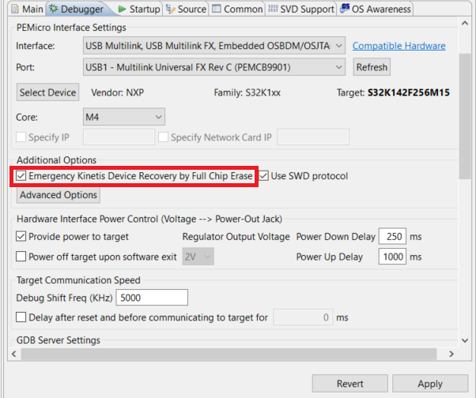
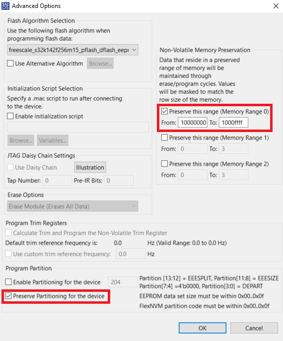

# NXP S32K1 Non-Volatile memory module FlexNVM Demo
Minimal implementation for the usage of the FlexNVM module with Emulated EEPROM functionality, using the S32K142 EVB.

In src/main.c boot_counter is incremented in each power-up or reset and conserved in non-volatile memory, the value of the counter can be viewed in a debug session.

Set the following debug configurations within S32DS

